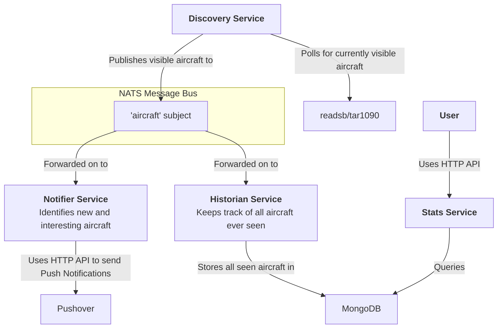

# Aircraft

Combines local ADS-B data with other data sources and notifies about interesting aircraft

## Overview

### Key features

- Triggers Push Notifications when interesting aircraft are spotted by tar1090
- Keeps track of all seen aircraft

### Diagram



## Getting started

### Prerequisites

- The hostname/ip address of a running [`readsb`](https://github.com/wiedehopf/readsb) instance
- For development: Node `22`

### Installation

1. Create `.env` files in `discovery`, `historian` and `notifier` directories. See `.env.example` files for what's required
2. Install submodules

```bash
git submodule init 
git submodule update
```

### Usage

```bash
docker compose up --build
```
